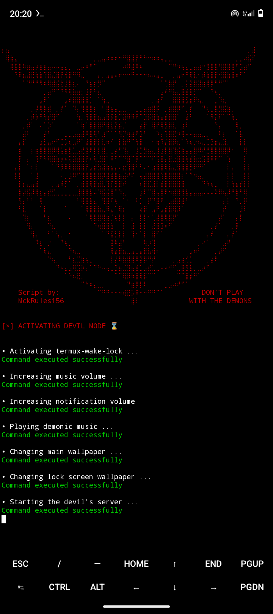
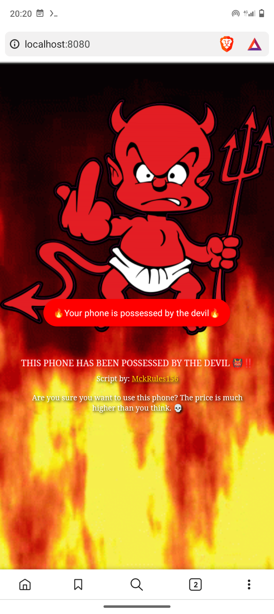
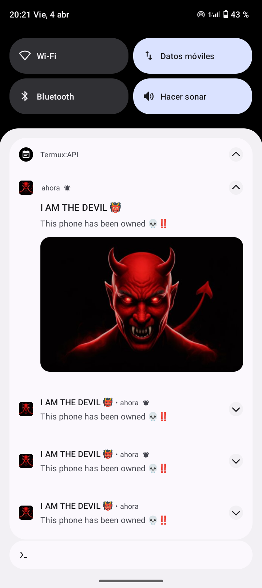
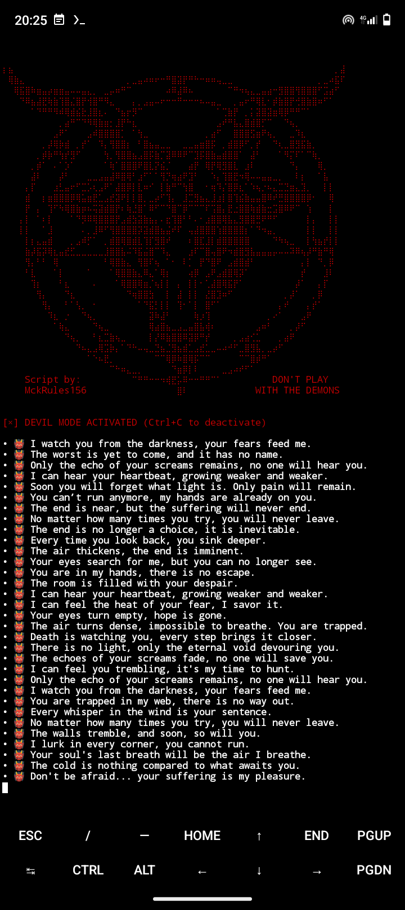
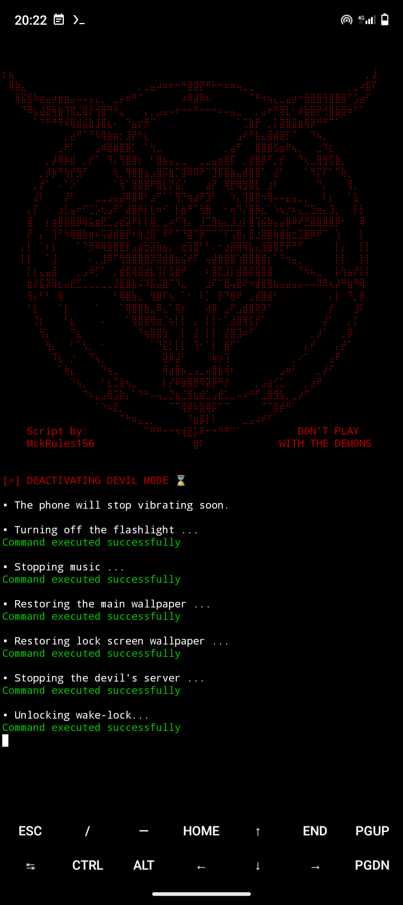
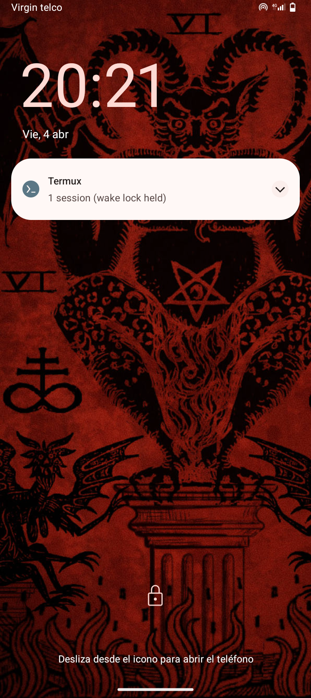

     


# DevilMode 👹
**This script not only executes commands, it invokes forces beyond comprehension. ...**  


## Description 📄

   Welcome to the **dark side** of technology! **DevilMode** is a script for **Termux** designed to turn your phone into a **digital portal to hell**. Get ready for a terrifying experience where the boundaries between reality and the supernatural blur.

This script transforms your device into a **possessed entity**, unleashing disturbing effects such as **demonic sounds**, **inexplicable vibrations**, and a **demonic server** that manifests in eerie ways. From **spine-chilling notifications** to changes in your phone's appearance, every action is carefully crafted to create an atmosphere of horror.

Whether you want to scare your friends, surprise someone with a macabre touch, or simply experiment with the paranormal, **DevilMode** is here to test your nerves. Because remember: the devil doesn’t need your soul… just your phone.

**Are you ready to unleash chaos?** 

## Compatibility 📲

This script is compatible with **Termux**. For full functionality, the **Termux:API** extension must be installed, providing access to various system features.  

## Features ⭐

This script will unleash a series of demonic effects on your device, turning it into a digital portal to hell. Some of the features include:

**1. Demonic Voice**: A demonic voice will declare that your device has been possessed, followed by a devilish laugh and a satanic melody that will send chills down your spine.

**2. Wallpaper Change**: Your wallpaper will transform into a terrifying image, giving your phone a dark and eerie atmosphere.

**3. Endless Vibration**: The phone will start vibrating non-stop, creating an unsettling and uncontrollable sensation.

**4. Flickering Flashlight**: Your phone’s flashlight will turn on and off by itself, as if controlled by dark forces.

**5. Floating Messages**: Creepy floating messages will appear on your screen, delivering sinister warnings from the other side.

**6. Devil’s Notifications**: You will receive mysterious and terrifying notifications from the devil himself, increasing the tension and confusion.

**7. Terminal Messages**: The terminal will display eerie messages in real time, as if your phone were possessed by an evil entity.

**8. Demonic Server**: A demonic server will run in the background and automatically open in the browser, providing an even more chilling experience.


## Screenshots 📸

<div>
  
  
  
</div>

<div>
  
  
  
</div>


## Script Installation 💻

#### 1. Install Termux  
If you don’t have **Termux** installed yet, you can download it from [Termux (F-Droid)](https://f-droid.org/packages/com.termux/).  

#### 2. Install the Termux:API extension  
Simply go to the following link to download the extension: [Termux:API (F-Droid)](https://f-droid.org/packages/com.termux.api/).  

#### 3. Install DevilMode
Run the following commands in the **Termux** terminal:  

```bash
git clone https://github.com/MckRules156/DevilMode.git
cd DevilMode
chmod +x Installer.sh
bash Installer.sh
bash DevilMode.sh
```

## Script Settings ⚙️  

#### 1. Configuration of the eerie messages displayed in the terminal  
To configure these messages, you can modify the "Mensajes" variable in the "DevilMode.sh" script.  

#### 2. Script timer configuration  
In the "timer" function of the "DevilMode.sh" script, you can adjust the timer delay.  

#### 3. Script audio configuration  
You can change the script's audio by replacing the file "Media/music.mp3" with your preferred audio file.  

#### 4. Wallpaper configuration  
Replace the file "Media/oldwallpaper.jpg" with your current wallpaper and "Media/oldwallpaperlock.jpg" with your lock screen wallpaper. The script will use these files to restore your original wallpapers when it stops.  

## Troubleshooting 🛠️  

If you encounter issues when running the installer `Instalador.sh`, it may be due to missing dependencies. If this happens, you can install them manually by following these steps:  

Open **Termux** and run the following commands to install the necessary dependencies:  

```bash
pkg install php -y
pkg install termux-tools -y
pkg install termux-api -y
pkg install xdg-utils -y
pkg update && pkg upgrade -y
```

## How to Use the Script? 🚀

**1. Using the script for personal use:**  
To run the script, make sure you have completed the installation without errors and simply navigate to the "DevilMode" folder and execute the "DevilMode.sh" script

```bash
cd DevilMode
bash DevilMode.sh
```

**2. Using the script to surprise a friend (With their consent):**  
If your goal is to surprise a friend, you can set a timer before executing the script and find an excuse to lend them your phone. Once your friend is using your device and the timer runs out, the script will start unexpectedly. At that moment, your friend will likely be puzzled, wondering: "What is happening here?". Given how surreal and strange this script is, anyone in that situation will be completely bewildered.

To do this, you can run the following command: (Allows Termux to run in the background and sets a 1-minute timer before launching the script)

```bash
termux-wake-lock && sleep 60 && bash DevilMode.sh
```
If you want to take the experience to the next level, try installing the script on someone else's phone without them noticing and schedule its execution. I guarantee that, in that case, the surprise will be much more intense.

## Legal Disclaimer ⚖️

This script has been created for entertainment and educational purposes. If you choose to use it for other purposes, such as surprising someone, make sure to obtain their consent and not cause them distress. It is the user's responsibility to ensure that its use does not violate local, national, or international laws. The developers are not responsible for any misuse or damage caused. Use this script responsibly and with respect!


## Donations 💸

If you like what I do and want to contribute to continue improving this project, here are several ways you can support me. Your contribution makes a difference.

#### Criptocoins 🪙 :
- **Bitcoin (BTC)**: bc1qdmxh86s30nm3nrdrstvggeaswjxz6pf2pmatxw
- **Ethereum (ETH)**: 0x03E3595E23A52A60e926FD549563DdB549454DF9
- **Dogecoin (DOGE)**: DTP7no4aHFQwLT7JTn8Ly4vBDo7LfHcRzJ
- **Monero (XMR)**: 4AsS593c1Q7abg9Ks8YfooigrAQhrpWqRcjQULjT2MmvDi9Q74ybFWTWyTQ1d7PkJADuSUwVkuxhdicukZJg6FPZ4y8e4Xx

Your support allows me to continue working on projects like this. Thank you for being here!

## Contact 📬
If you have any questions or suggestions, you can contact me through:
- Email: [MckRules156@proton.me](mailto:MckRules156@proton.me)
- GitHub: [@MckRules156](https://github.com/MckRules156)


